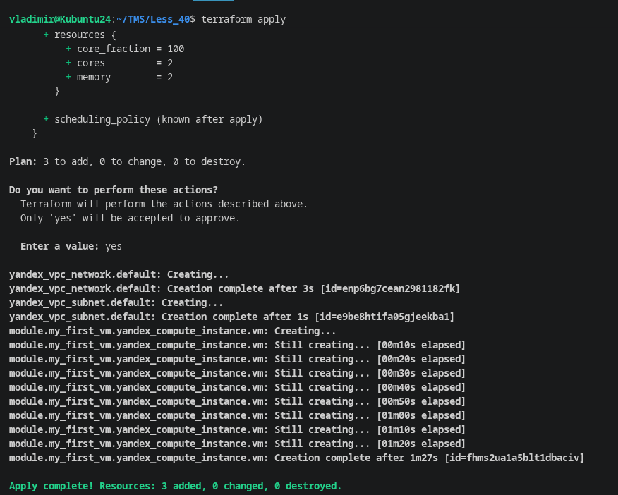
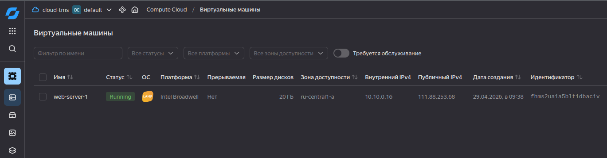
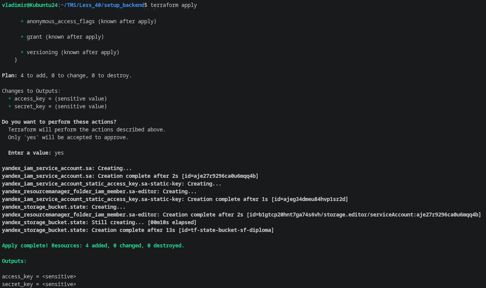
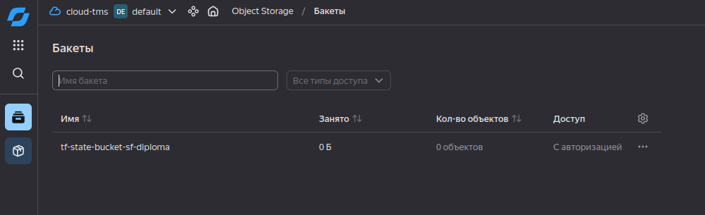
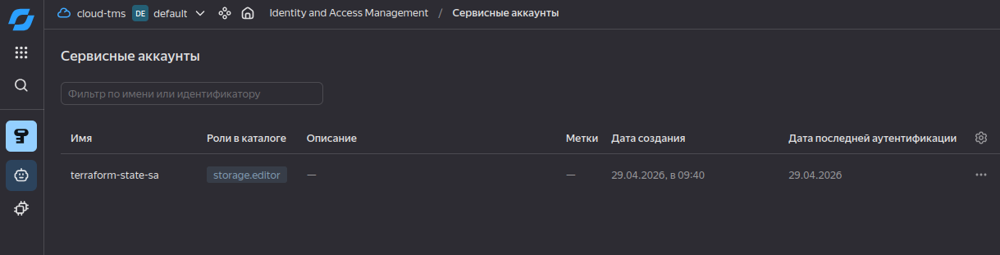
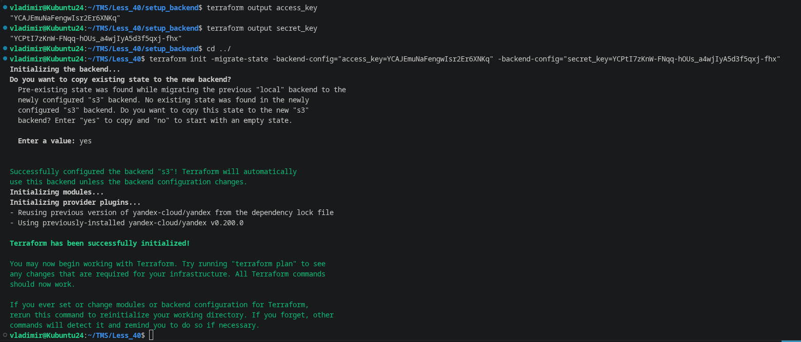
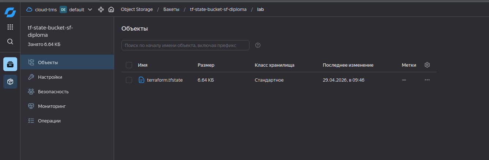
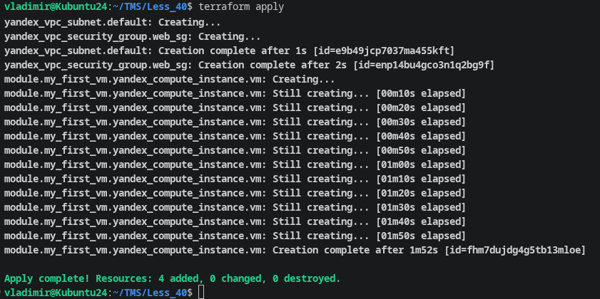

# HOMEWORK #40

## Создал сеть, подсеть и ВМ из модуля /modules/yandex_vm

## Создал сервисный аккаунт, предоставил ему права, создал для него ключ и создал S3 хранилище для хранения состояний terraform из директории setup_backend

## Мигрировал хранение состояния terraform с ключем -migrate-state в S3 хранилище

## Добавил в terraform security_group и в модуль создания ВМ добавил зависимость 'depends_on = [ yandex_vpc_security_group.web_sg ]', явно указав, чтобы ВМ создавалась только после сооздания security_group

## ВМ создалась только после security_group